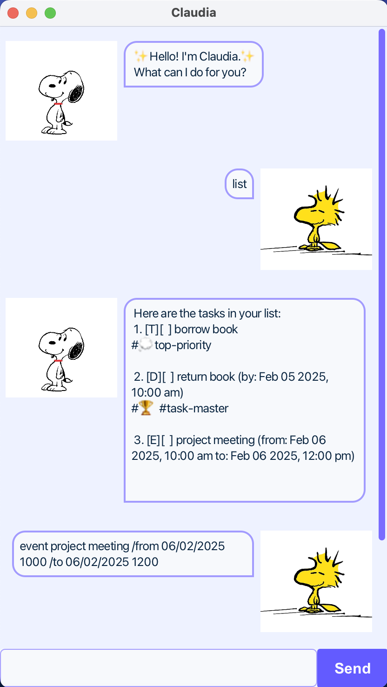

# Claudia User Guide

Claudia is a Personal Assistant Chatbot to help the user keep track of their tasks using the *Command Line Interface (CLI)*.

## Table of Contents

- [Features](#features)
  - [Adding ToDo](#adding-todo)
  - [Adding Deadline](#adding-deadline)
  - [Adding Event](#adding-todo)
  - [Listing all tasks](#listing-all-tasks)
  - [Mark a task](#mark-a-task)
  - [Unmark a task](#unmark-a-task)
  - [Delete a task](#delete-a-task)
  - [Find a task](#find-a-task)
  - [Tag a task](#tag-a-task)
  - [Exit Claudia Chatbot](#exit-claudia-chatbot)
  - [Saving the data](#saving-the-data)
- [FAQ](#faq)
- [Acknowledgements](#acknowledgements)

## Features

### Adding ToDo

ToDo: task without any date/time attached to it

**Format**: `todo DESCRIPTION`

**Example**: `todo borrow book`

### Adding Deadline

Deadline: task that needs to be done before a specific date/time

**Format**: `deadline DESCRIPTION /by DATE`

**Example**: `deadline return book /by 05/02/2025 1000`

### Adding Event

Event: task that starts at a specific date/time and ends at a specific date/time

**Format**: `event DESCRIPTION /from DATE /to DATE`

**Example**: `event project meeting /from 06/02/2025 1000 /to 06/02/2025 1200`

### Listing all tasks

Shows a list of all the user's tasks.

**Format**: `list`

### Mark a task

**Mark** a task as *done*.

**Format**: `mark INDEX`

**Example**: `mark 2`

### Unmark a task

**Unmark** to change the status back to *not done*.

**Format**: `unmark INDEX`

**Example**: `unmark 2`

### Delete a task

Delete the specified task from the list.

**Format**: `delete INDEX`

- Deletes the task at the specified `INDEX`
- The index refers to the index number shown in the task list.
- The index must be a **positive integer** 1, 2, 3...

**Example**:
- `list` followed by `delete 3` deletes the 3rd task in the list

### Find a task

Find tasks that contains any of the given keywords.

**Format**: `find KEYWORD [MORE_KEYWORDS]`

- The search is case-insensitive. e.g. `book` will match `Book`
- The order of the keywords does not matter. e.g. `book project` will match `project book`
- Only the task description is searched.
- Oly full words will be matched e.g. `Book` will not match `Books`
- Tasks matching at least one keyword will be returned (i.e. `OR` search). e.g. `book` will return `borrow book`, `return book`

**Example**:
- `find project` returns `project meeting`

### Tag a task

Tag a task with one or more tags.

**Format**: `tag INDEX TAG [MORE_TAGS]`

**Example**:
- `tag 2 school urgent`
- `#school` and `#urgent` will be tagged to Task 2

### Exit Claudia Chatbot

Terminates Claudia Chatbot session.

**Format**: `bye`

### Saving the data

Task list data are saved automatically as a TXT file `[JAR file location]/data/claudia.txt`. Advanced users are welcome to update data directly by editing that data file.

❗**Caution**: If your changes to the data file makes its format invalid, Claudia will return an error parsing data. Hence, it is recommended to take a backup of the file before editing it. Edit the data file only if you are confident that you can update it correctly.

## FAQ

**Q**: How do I transfer my data to another Computer?

**A**: Install the jar file in the other computer and overwrite the empty data file it creates with the file that contains the data of your previous Claudia folder.

**Q**: How to run Claudia Chatbot?

**A**: Install the jar file under GitHub Releases in this repository. Navigate to the folder with `claudia.jar` using the `cd` command. Run the command `java -jar claudia.jar`.

## Acknowledgements

Part of the JavaDocs comments were generated with the assistance of ChatGPT.