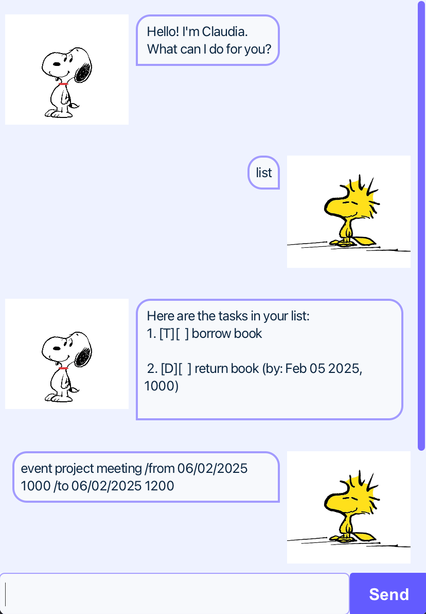

# claudia.ui.Claudia User Guide



claudia.ui.Claudia is a Personal Assistant Chatbot to help the user keep track of their claudia.task using the *Command Line Interface (CLI)*.

## Table of Contents

- [Features](#features)
    - [Adding ToDo](#adding-todo)
    - [Adding Deadline](#adding-deadline)
    - [Adding Event](#adding-todo)
    - [Listing all claudia.task](#listing-all-tasks)
    - [Mark/Unmark a claudia.task](#markunmark-a-task)
    - [Delete a claudia.task](#delete-a-task)
    - [Exit claudia.ui.Claudia Chatbot](#exit-claudia-chatbot)

## Features

### Adding ToDo

ToDo: claudia.task without any date/time attached to it

**Command**: `todo DESCRIPTION`

**Example**: `todo borrow book`

**Expected Output**:
```
Got it. I've added this claudia.task:
 [T][ ] borrow book
Now you have 1 claudia.task in the list.
```

### Adding Deadline

Deadline: claudia.task that needs to be done before a specific date/time

**Command**: `deadline DESCRIPTION /by DATE`

**Example**: `deadline return book /by Sunday`

**Expected Output**:
```
Got it. I've added this claudia.task:
 [D][ ] return book (by: Sunday)
Now you have 2 claudia.task in the list.
```

### Adding Event

Event: claudia.task that starts at a specific date/time and ends at a specific date/time

**Command**: `event DESCRIPTION /from DATE /to DATE`

**Example**: `event project meeting /from Mon 2pm /to 4pm`

**Expected Output**:
```
Got it. I've added this claudia.task:
 [E][ ] project meeting (from: Mon 2pm to: 4pm)
Now you have 3 claudia.task in the list.
```

### Listing all claudia.task

Displays a list of all the user's claudia.task.

**Command**: `list`

**Expected Output**:
```
Here are the claudia.task in your list:
1.[T][ ] borrow book
2.[D][ ] return book (by: Sunday)
3.[E][ ] project meeting (from: Mon 2pm to: 4pm)
```

### Mark/Unmark a claudia.task

**Mark** claudia.task as *done*.

**Command**: `mark ID`

**Example**: `mark 2`

**Expected Output**:
```
Nice! I've marked this claudia.task as done:
 [D][X] return book (by: Sunday)
```

**Unmark** to change the status back to *not done*.

**Command**: `unmark ID`

**Example**: `unmark 2`

**Expected Output**:
```
OK, I've marked this claudia.task as not done yet:
 [D][ ] return book (by: Sunday)
```

### Delete a claudia.task

Delete a claudia.task from the list.

**Command**: `delete ID`

**Example**: `delete 3`

**Expected Output**:
```
Noted. I've removed this claudia.task:
 [E][ ] project meeting (from: Mon 2pm to: 4pm)
Now you have 2 claudia.task in the list.
```

### Exit claudia.ui.Claudia Chatbot

Terminates claudia.ui.Claudia Chatbot session.

**Command**: `bye`

**Expected Output**:
```
Bye. Hope to see you again soon!
```